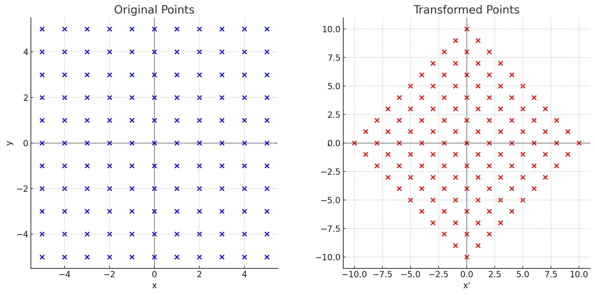
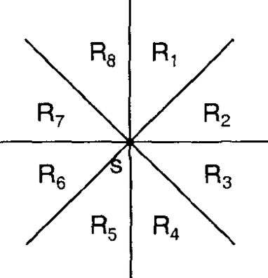
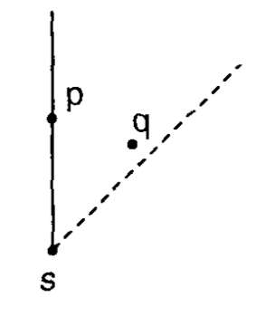
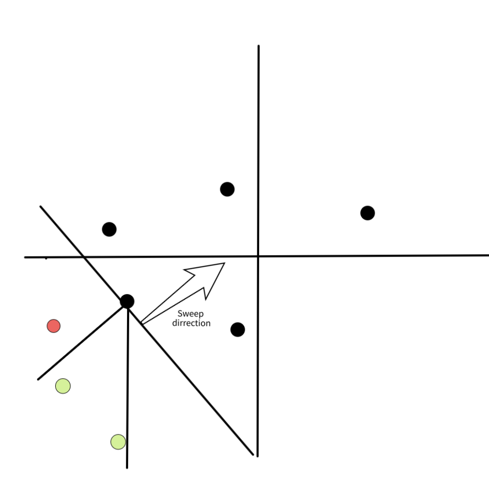
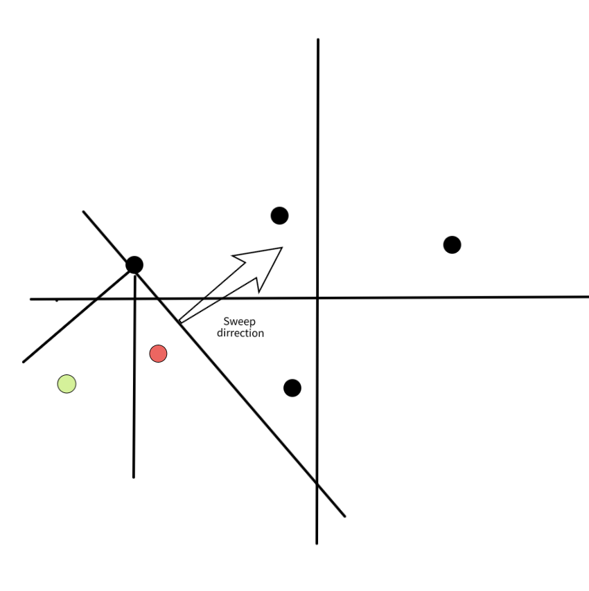

---
tags:
  - AI Translated
e_maxx_link: manhattan-distance
---

# فاصله منهتن
	
## تعریف
برای نقاط $p$ و $q$ روی یک صفحه، می‌توانیم فاصله بین آن‌ها را به عنوان مجموع اختلاف مؤلفه‌های $x$ و $y$ آن‌ها تعریف کنیم: 

$$d(p,q) = |x_p - x_q| + |y_p - y_q|$$

فاصله تعریف‌شده به این روش، متناظر با هندسه‌ای است که [هندسه منهتن (تاکسی)](https://en.wikipedia.org/wiki/Taxicab_geometry) نامیده می‌شود. در این هندسه، نقاط به عنوان تقاطع‌هایی در یک شهر خوش‌طرح، مانند منهتن، در نظر گرفته می‌شوند که در آن فقط می‌توان به صورت افقی یا عمودی در خیابان‌ها حرکت کرد، همانطور که در تصویر زیر نشان داده شده است:

<div style="text-align: center;">
  
</div>

این تصویر برخی از کوتاه‌ترین مسیرها از یک نقطه سیاه به نقطه دیگر را نشان می‌دهد که همگی طولی برابر با $12$ دارند.

ترفندها و الگوریتم‌های جالبی وجود دارند که می‌توان با این فاصله انجام داد و ما در اینجا برخی از آن‌ها را نشان خواهیم داد.

## دورترین جفت نقاط در فاصله منهتن

با داشتن $n$ نقطه $P$، می‌خواهیم جفت نقطه $p,q$ را پیدا کنیم که بیشترین فاصله را از هم دارند، یعنی $|x_p - x_q| + |y_p - y_q|$ را بیشینه کنیم.

ابتدا حالت یک‌بعدی را در نظر بگیریم، یعنی $y=0$. نکته اصلی این است که می‌توانیم برای عبارت $|x_p - x_q|$ هر دو حالت $x_p - x_q$ و $-x_p + x_q$ را امتحان کنیم، زیرا اگر "علامت" قدر مطلق را اشتباه در نظر بگیریم، تنها یک مقدار کوچکتر به دست می‌آوریم که نمی‌تواند بر پاسخ تأثیر بگذارد. به طور رسمی‌تر، داریم:

$$|x_p - x_q| = \max(x_p - x_q, -x_p + x_q)$$

بنابراین، برای مثال، می‌توانیم سعی کنیم $p$ را طوری انتخاب کنیم که $x_p$ علامت مثبت داشته باشد و در نتیجه $x_q$ باید علامت منفی داشته باشد. به این ترتیب می‌خواهیم عبارت زیر را پیدا کنیم:

$$\max\limits_{p, q \in P}(x_p + (-x_q)) = \max\limits_{p \in P}(x_p) + \max\limits_{q \in P}( - x_q ).$$

توجه کنید که می‌توانیم این ایده را برای ۲ (یا بیشتر!) بعد نیز گسترش دهیم. برای $d$ بعد، باید $2^d$ حالت ممکن برای علامت‌ها را به روش brute-force امتحان کنیم. برای مثال، اگر در ۲ بعد باشیم و حالتی را امتحان کنیم که هر دو مؤلفه $p$ علامت مثبت دارند، می‌خواهیم عبارت زیر را پیدا کنیم:

$$\max\limits_{p, q \in P} [(x_p + (-x_q)) + (y_p + (-y_q))] = \max\limits_{p \in P}(x_p + y_p) + \max\limits_{q \in P}(-x_q - y_q).$$

از آنجایی که $p$ و $q$ را از هم مستقل کردیم، اکنون پیدا کردن $p$ و $q$ که عبارت را بیشینه می‌کنند، آسان است.

کد زیر این ایده را برای $d$ بعد تعمیم می‌دهد و در زمان $O(n \cdot 2^d \cdot d)$ اجرا می‌شود.

```cpp
long long ans = 0;
for (int msk = 0; msk < (1 << d); msk++) {
    long long mx = LLONG_MIN, mn = LLONG_MAX;
    for (int i = 0; i < n; i++) {
        long long cur = 0;
        for (int j = 0; j < d; j++) {
            if (msk & (1 << j)) cur += p[i][j];
            else cur -= p[i][j];
        }
        mx = max(mx, cur);
        mn = min(mn, cur);
    }
    ans = max(ans, mx - mn);
}
```

## چرخش نقاط و فاصله چبیشف

به خوبی می‌دانیم که برای تمام $m, n \in \mathbb{R}$،

$$|m| + |n| = \text{max}(|m + n|, |m - n|).$$

برای اثبات این موضوع، فقط کافی است علامت‌های $m$ و $n$ را تحلیل کنیم. این کار به عنوان یک تمرین واگذار می‌شود.

می‌توانیم این معادله را در فرمول فاصله منهتن به کار ببریم تا به این نتیجه برسیم که

$$d((x_1, y_1), (x_2, y_2)) = |x_1 - x_2| + |y_1 - y_2| = \text{max}(|(x_1 + y_1) - (x_2 + y_2)|, |(x_1 - y_1) - (x_2 - y_2)|).$$

عبارت آخر در معادله قبل، همان [فاصله چبیشف](https://en.wikipedia.org/wiki/Chebyshev_distance) بین نقاط $(x_1 + y_1, x_1 - y_1)$ و $(x_2 + y_2, x_2 - y_2)$ است. این به این معنی است که پس از اعمال تبدیل

$$\alpha : (x, y) \to (x + y, x - y),$$

فاصله منهتن بین نقاط $p$ و $q$ به فاصله چبیشف بین $\alpha(p)$ و $\alpha(q)$ تبدیل می‌شود.

همچنین، می‌توانیم متوجه شویم که $\alpha$ یک [تشابه مارپیچی](https://en.wikipedia.org/wiki/Spiral_similarity) (یک چرخش صفحه و به دنبال آن یک تجانس حول مرکز $O$) با مرکز $(0, 0)$، زاویه چرخش $45^{\circ}$ در جهت عقربه‌های ساعت و ضریب تجانس $\sqrt{2}$ است.

در اینجا تصویری برای کمک به تجسم این تبدیل آورده شده است:

<div style="text-align: center;">
  
</div>

## درخت پوشای کمینه منهتن

مسئله درخت پوشای کمینه منهتن (Manhattan MST) عبارت است از: با داشتن تعدادی نقطه در صفحه، یال‌هایی را پیدا کنید که همه نقاط را به هم متصل کرده و مجموع وزن‌هایشان کمینه باشد. وزن هر یال که دو نقطه را به هم متصل می‌کند، فاصله منهتن بین آن دو نقطه است. برای سادگی، فرض می‌کنیم که همه نقاط مکان‌های متفاوتی دارند.
در اینجا روشی برای یافتن MST در زمان $O(n \log{n})$ ارائه می‌دهیم. در این روش برای هر نقطه، نزدیک‌ترین همسایه آن در هر هشت ناحیه (octant) را پیدا می‌کنیم، همانطور که در تصویر زیر نشان داده شده است. این کار به ما $O(n)$ یال کاندید می‌دهد که همانطور که در ادامه نشان خواهیم داد، تضمین می‌کند که MST را در بر دارند. گام نهایی استفاده از یک الگوریتم استاندارد MST است، برای مثال، [الگوریتم کروسکال با استفاده از disjoint set union](https://cp-algorithms.com/graph/mst_kruskal_with_dsu.html).

<div style="text-align: center;">
  
  *۸ ناحیه (octant) نسبت به نقطه S*
</div>

الگوریتمی که در اینجا نشان داده شده است اولین بار در مقاله‌ای از [H. Zhou، N. Shenoy، و W. Nichollos (2002)](https://ieeexplore.ieee.org/document/913303) ارائه شد. الگوریتم شناخته‌شده دیگری نیز وجود دارد که از رویکرد تقسیم و حل (Divide and conquer) توسط [J. Stolfi](https://www.academia.edu/15667173/On_computing_all_north_east_nearest_neighbors_in_the_L1_metric) استفاده می‌کند که آن هم بسیار جالب است و تنها در روش پیدا کردن نزدیک‌ترین همسایه در هر octant تفاوت دارد. هر دو الگوریتم پیچیدگی زمانی یکسانی دارند، اما الگوریتمی که در اینجا ارائه شده پیاده‌سازی ساده‌تری دارد و ضریب ثابت آن کمتر است.

ابتدا، بیایید بفهمیم چرا کافی است فقط نزدیک‌ترین همسایه در هر octant را در نظر بگیریم. ایده این است که نشان دهیم برای یک نقطه $s$ و هر دو نقطه دیگر $p$ و $q$ در همان octant، داریم $d(p, q) < \max(d(s, p), d(s, q))$. این موضوع مهم است، زیرا نشان می‌دهد که اگر یک MST وجود داشته باشد که در آن $s$ به هر دو نقطه $p$ و $q$ متصل باشد، می‌توانیم یکی از این یال‌ها را حذف کرده و یال $(p,q)$ را اضافه کنیم که هزینه کل را کاهش می‌دهد. برای اثبات این موضوع، بدون از دست دادن کلیت فرض می‌کنیم که $p$ و $q$ در octant $R_1$ قرار دارند که با شرایط $x_s \leq x$ و $x_s - y_s > x - y$ تعریف می‌شود و سپس با بررسی چند حالت، اثبات را کامل می‌کنیم. تصویر زیر شهودی از چرایی درست بودن این موضوع ارائه می‌دهد.

<div style="text-align: center;">
  
  *به طور شهودی، محدودیت octant باعث می‌شود غیرممکن باشد که $p$ و $q$ هر دو به $s$ نزدیک‌تر از فاصله خودشان با یکدیگر باشند*
</div>


بنابراین، سؤال اصلی این است که چگونه نزدیک‌ترین همسایه را در هر octant برای تک‌تک $n$ نقطه پیدا کنیم.

## یافتن نزدیک‌ترین همسایه در هر Octant در $O(n \log n)$

برای سادگی، روی octant شمال-شمال-شرق (NNE) (همان $R_1$ در تصویر بالا) تمرکز می‌کنیم. تمام جهات دیگر را می‌توان با همین الگوریتم و با چرخاندن ورودی پیدا کرد.

ما از رویکرد خط جاروب (sweep-line) استفاده خواهیم کرد. نقاط را از جنوب-غربی به شمال-شرقی، یعنی بر اساس ترتیب غیر نزولی $x + y$ پردازش می‌کنیم. همچنین مجموعه‌ای از نقاط را که هنوز نزدیک‌ترین همسایه خود را پیدا نکرده‌اند، نگه می‌داریم که آن را "مجموعه فعال" می‌نامیم. تصاویر زیر را برای کمک به تجسم الگوریتم اضافه کرده‌ایم.

<div style="text-align: center;">
  
  *با رنگ سیاه و یک فلش، جهت خط جاروب نشان داده شده است. تمام نقاط زیر این خط در مجموعه فعال قرار دارند و نقاط بالای آن هنوز پردازش نشده‌اند. با رنگ سبز نقاطی را می‌بینیم که در octant نقطه پردازش‌شده قرار دارند. با رنگ قرمز نقاطی که در octant مورد نظر نیستند، مشخص شده‌اند.*
</div>

<div style="text-align: center;">
  
  *در این تصویر، مجموعه فعال را پس از پردازش نقطه $p$ مشاهده می‌کنیم. توجه کنید که ۲ نقطه سبز تصویر قبل، نقطه $p$ را در octant شمال-شمال-شرق خود داشتند و دیگر در مجموعه فعال نیستند، زیرا نزدیک‌ترین همسایه خود را پیدا کرده‌اند.*
</div>

هنگامی که یک نقطه جدید $p$ را اضافه می‌کنیم، برای هر نقطه $s$ که $p$ در octant آن قرار دارد، می‌توانیم با خیال راحت $p$ را به عنوان نزدیک‌ترین همسایه آن تعیین کنیم. این امر به این دلیل درست است که فاصله آنها $d(p,s) = |x_p - x_s| + |y_p - y_s| = (x_p + y_p) - (x_s + y_s)$ است، زیرا $p$ در octant شمال-شمال-شرق قرار دارد. از آنجایی که به دلیل مرحله مرتب‌سازی، هیچ یک از نقاط بعدی مقدار $x+y$ کوچکتری نخواهند داشت، تضمین می‌شود که $p$ کمترین فاصله را دارد. سپس می‌توانیم تمام این نقاط را از مجموعه فعال حذف کرده و در نهایت $p$ را به مجموعه فعال اضافه کنیم.

سوال بعدی این است که چگونه به طور کارآمد نقاط $s$ را پیدا کنیم که $p$ در octant شمال-شمال-شرق آنها قرار دارد. یعنی، کدام نقاط $s$ در شرایط زیر صدق می‌کنند:

- $x_s \leq x_p$
- $x_p - y_p < x_s - y_s$

از آنجایی که هیچ نقطه‌ای در مجموعه فعال در ناحیه $R_1$ نقطه دیگری قرار ندارد، همچنین داریم که برای دو نقطه $q_1$ و $q_2$ در مجموعه فعال، $x_{q_1} \neq x_{q_2}$ و ترتیب آنها ایجاب می‌کند که $x_{q_1} < x_{q_2} \implies x_{q_1} - y_{q_1} \leq x_{q_2} - y_{q_2}$.

می‌توانید این موضوع را در تصاویر بالا با تصور کردن ترتیب $x - y$ به عنوان یک "خط جاروب" که از شمال-غربی به جنوب-شرقی می‌رود، یعنی عمود بر خطی که رسم شده است، تجسم کنید.

این به این معنی است که اگر مجموعه فعال را بر اساس $x$ مرتب نگه داریم، کاندیدهای $s$ به صورت متوالی قرار می‌گیرند. سپس می‌توانیم بزرگترین $x_s \leq x_p$ را پیدا کرده و نقاط را به ترتیب نزولی $x$ پردازش کنیم تا زمانی که شرط دوم $x_p - y_p < x_s - y_s$ نقض شود (در واقع می‌توانیم اجازه دهیم $x_p - y_p = x_s - y_s$ باشد که حالت نقاط با مؤلفه‌های برابر را نیز پوشش می‌دهد). توجه کنید که چون بلافاصله پس از پردازش، نقاط را از مجموعه حذف می‌کنیم، این کار دارای پیچیدگی سرشکن (amortized) $O(n \log(n))$ خواهد بود.
	حالا که نزدیک‌ترین نقطه در جهت شمال-شرق را داریم، نقاط را می‌چرخانیم و تکرار می‌کنیم. می‌توان نشان داد که در واقع به این روش نزدیک‌ترین نقطه در جهت جنوب-غرب را نیز پیدا می‌کنیم، بنابراین می‌توانیم فقط ۴ بار تکرار کنیم، به جای ۸ بار.

به طور خلاصه:

- نقاط را بر اساس $x+y$ به ترتیب غیر نزولی مرتب می‌کنیم؛
- برای هر نقطه، مجموعه فعال را از نقطه‌ای با بزرگترین $x$ که $x \leq x_p$ است، پیمایش می‌کنیم و اگر $x_p - y_p \geq x_s - y_s$ باشد، حلقه را متوقف می‌کنیم. برای هر نقطه معتبر $s$، یال $(s,p, d(s,p))$ را به لیست خود اضافه می‌کنیم؛
- نقطه $p$ را به مجموعه فعال اضافه می‌کنیم؛
- نقاط را می‌چرخانیم و تکرار می‌کنیم تا زمانی که تمام octantها را پیمایش کنیم.
- الگوریتم کروسکال را روی لیست یال‌ها اجرا می‌کنیم تا MST را به دست آوریم.

در زیر می‌توانید یک پیاده‌سازی را مشاهده کنید که بر اساس پیاده‌سازی موجود در [KACTL](https://github.com/kth-competitive-programming/kactl/blob/main/content/geometry/ManhattanMST.h) است.

```{.cpp file=manhattan_mst}
struct point {
    long long x, y;
};

// لیستی از یال‌ها با فرمت (وزن، u، v) برمی‌گرداند.
// ارسال این لیست به الگوریتم کروسکال، MST منهتن را به دست می‌دهد.
vector<tuple<long long, int, int>> manhattan_mst_edges(vector<point> ps) {
    vector<int> ids(ps.size());
    iota(ids.begin(), ids.end(), 0);
    vector<tuple<long long, int, int>> edges;
    for (int rot = 0; rot < 4; rot++) { // برای هر چرخش
        sort(ids.begin(), ids.end(), [&](int i, int j){
            return (ps[i].x + ps[i].y) < (ps[j].x + ps[j].y);
        });
        map<int, int, greater<int>> active; // (xs, id)
        for (auto i : ids) {
            for (auto it = active.lower_bound(ps[i].x); it != active.end();
            active.erase(it++)) {
                int j = it->second;
                if (ps[i].x - ps[i].y > ps[j].x - ps[j].y) break;
                assert(ps[i].x >= ps[j].x && ps[i].y >= ps[j].y);
                edges.push_back({(ps[i].x - ps[j].x) + (ps[i].y - ps[j].y), i, j});
            }
            active[ps[i].x] = i;
        }
        for (auto &p : ps) { // چرخش
            if (rot & 1) p.x *= -1;
            else swap(p.x, p.y);
        }
    }
    return edges;
}
```

## مسائل
 * [AtCoder Beginner Contest 178E - Dist Max](https://atcoder.jp/contests/abc178/tasks/abc178_e)
 * [CodeForces 1093G - Multidimensional Queries](https://codeforces.com/contest/1093/problem/G)
 * [CodeForces 944F - Game with Tokens](https://codeforces.com/contest/944/problem/F)
 * [AtCoder Code Festival 2017D - Four Coloring](https://atcoder.jp/contests/code-festival-2017-quala/tasks/code_festival_2017_quala_d)
 * [The 2023 ICPC Asia EC Regionals Online Contest (I) - J. Minimum Manhattan Distance](https://codeforces.com/gym/104639/problem/J)
 * [Petrozavodsk Winter Training Camp 2016 Contest 4 - B. Airports](https://codeforces.com/group/eqgxxTNwgd/contest/100959/attachments)