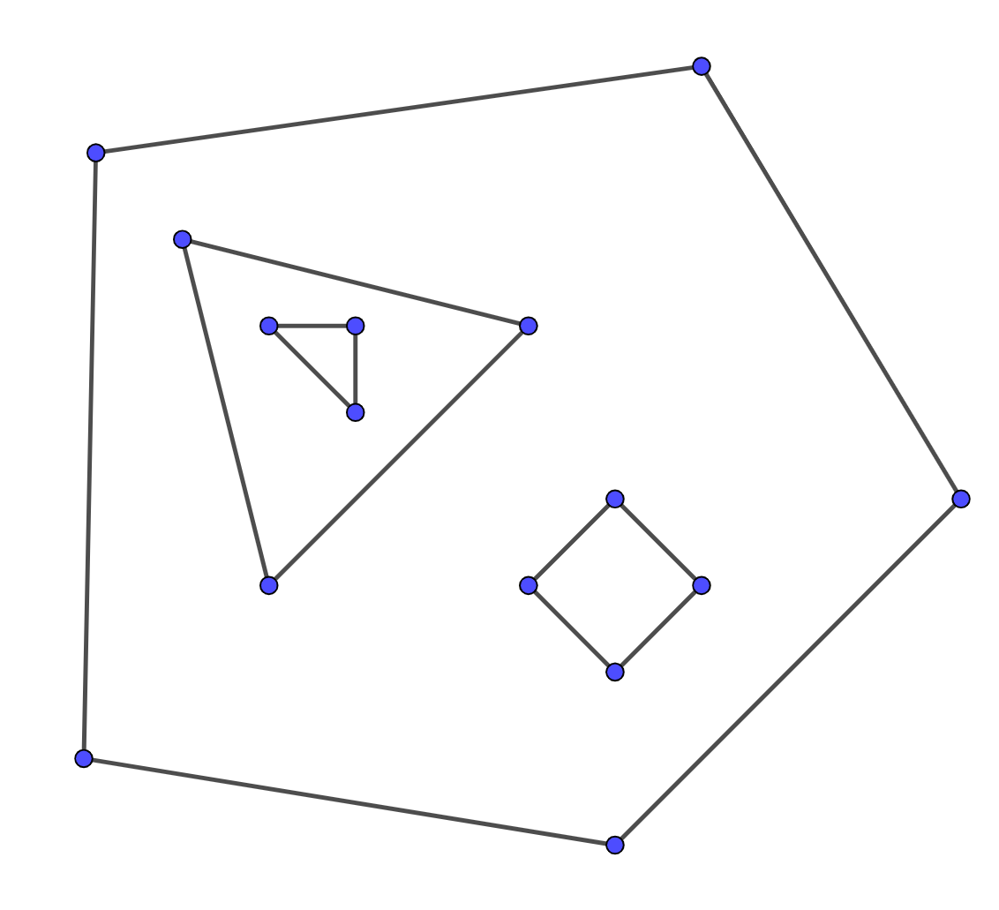
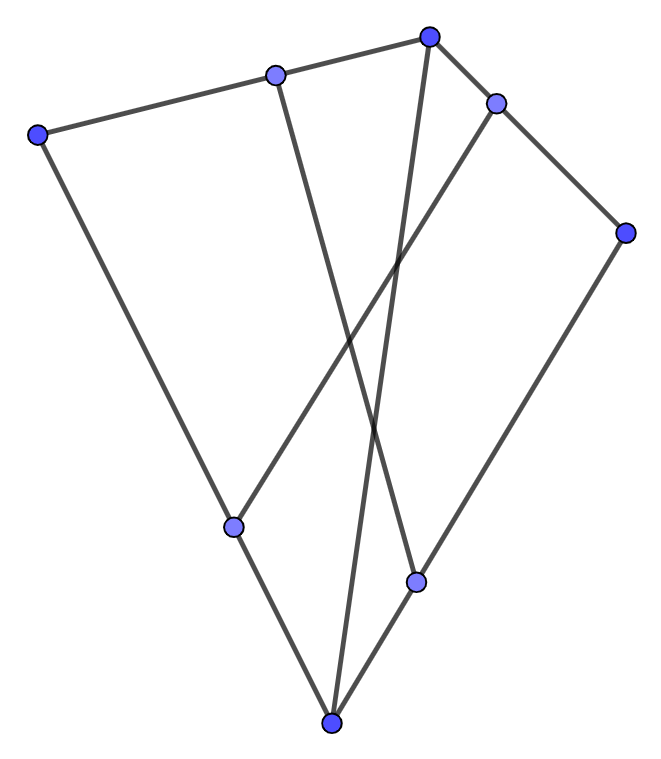

---
tags:
  - AI Translated
e_maxx_link: planar
---

# پیدا کردن وجوه یک گراف مسطح

گراف $G$ با $n$ رأس و $m$ یال را در نظر بگیرید که می‌توان آن را روی یک صفحه به طوری رسم کرد که دو یال فقط در رأس مشترکشان (در صورت وجود) یکدیگر را قطع کنند.
چنین گراف‌هایی **مسطح** نامیده می‌شوند. حال فرض کنید یک گراف مسطح به همراه جایگذاری با خطوط مستقیم (straight-line embedding) آن به ما داده شده است، به این معنی که برای هر رأس $v$ یک نقطه متناظر $(x, y)$ داریم و تمام یال‌ها به صورت پاره‌خط بین این نقاط بدون تقاطع رسم شده‌اند (چنین جایگذاری‌ای همیشه وجود دارد). این پاره‌خط‌ها صفحه را به چندین ناحیه تقسیم می‌کنند که «وجه» (face) نامیده می‌شوند. دقیقاً یکی از این وجوه نامحدود است. این وجه، وجه **بیرونی** (outer) نامیده می‌شود، در حالی که سایر وجوه، **درونی** (inner) نامیده می‌شوند.

در این مقاله به پیدا کردن هر دو نوع وجه درونی و بیرونی یک گراف مسطح می‌پردازیم. فرض می‌کنیم که گراف همبند است.

## چند حقیقت در مورد گراف‌های مسطح

در این بخش چندین حقیقت در مورد گراف‌های مسطح را بدون اثبات ارائه می‌دهیم. خوانندگانی که به اثبات‌ها علاقه‌مند هستند می‌توانند به کتاب [Graph Theory by R. Diestel](https://www.math.uni-hamburg.de/home/diestel/books/graph.theory/preview/Ch4.pdf) (همچنین [سخنرانی‌های ویدیویی در مورد مسطح بودن](https://www.youtube.com/@DiestelGraphTheory) بر اساس این کتاب را ببینید) یا کتاب دیگری مراجعه کنند.

### قضیه اویلر
قضیه اویلر بیان می‌کند که هر جایگذاری صحیح از یک گراف مسطح همبند با $n$ رأس، $m$ یال و $f$ وجه، در رابطه‌ی زیر صدق می‌کند:

$$n - m + f = 2$$

و به طور کلی‌تر، هر گراف مسطح با $k$ مؤلفه همبندی در رابطه‌ی زیر صدق می‌کند:

$$n - m + f = 1 + k$$

### تعداد یال‌های یک گراف مسطح
اگر $n \ge 3$ باشد، آنگاه بیشترین تعداد یال‌ها در یک گراف مسطح با $n$ رأس برابر با $3n - 6$ است. این تعداد توسط هر گراف مسطح همبندی که در آن هر وجه توسط یک مثلث محدود شده باشد، به دست می‌آید. از نظر پیچیدگی این حقیقت به این معناست که برای هر گراف مسطح $m = O(n)$ است.

### تعداد وجوه یک گراف مسطح
به عنوان یک نتیجه مستقیم از حقیقت بالا، اگر $n \ge 3$ باشد، آنگاه بیشترین تعداد وجوه در یک گراف مسطح با $n$ رأس برابر با $2n-4$ است.

### حداقل درجه رأس در یک گراف مسطح
هر گراف مسطح دارای یک رأس با درجه ۵ یا کمتر است.

## الگوریتم

ابتدا، یال‌های مجاور برای هر رأس را بر اساس زاویه قطبی مرتب کنید.
حال بیایید گراف را به روش زیر پیمایش کنیم. فرض کنید از طریق یال $(v, u)$ وارد رأس $u$ شده‌ایم و $(u, w)$ یال بعدی پس از $(v, u)$ در لیست مجاورت مرتب‌شده‌ی $u$ است. آنگاه رأس بعدی $w$ خواهد بود. مشخص می‌شود که اگر این پیمایش را از یک یال $(v, u)$ شروع کنیم، دقیقاً یکی از وجوه مجاور با $(v, u)$ را پیمایش خواهیم کرد. اینکه کدام وجه پیمایش شود، بستگی به این دارد که گام اول ما از $u$ به $v$ باشد یا از $v$ به $u$.

حال، الگوریتم کاملاً واضح است. باید روی تمام یال‌های گراف تکرار کنیم و پیمایش را برای هر یالی که در پیمایش‌های قبلی بازدید نشده باشد، شروع کنیم. به این روش، هر وجه را دقیقاً یک بار پیدا خواهیم کرد و هر یال دو بار (یک بار در هر جهت) پیمایش خواهد شد.

### پیدا کردن یال بعدی
در طول پیمایش باید یال بعدی را در جهت پادساعتگرد پیدا کنیم. واضح‌ترین راه برای پیدا کردن یال بعدی، جستجوی دودویی بر اساس زاویه است. با این حال، با داشتن ترتیب پادساعتگرد یال‌های مجاور برای هر رأس، می‌توانیم یال‌های بعدی را پیش‌محاسبه کرده و آن‌ها را در یک جدول درهم‌سازی (hash table) ذخیره کنیم. اگر یال‌ها از قبل بر اساس زاویه مرتب شده باشند، پیچیدگی پیدا کردن تمام وجوه در این حالت خطی می‌شود.

### پیدا کردن وجه بیرونی
دیدن این موضوع سخت نیست که الگوریتم هر وجه درونی را در جهت ساعتگرد و وجه بیرونی را در جهت پادساعتگرد پیمایش می‌کند، بنابراین وجه بیرونی را می‌توان با بررسی جهت پیمایش هر وجه پیدا کرد.

### پیچیدگی
کاملاً واضح است که پیچیدگی الگوریتم به دلیل مرتب‌سازی $O(m \log m)$ است و از آنجایی که $m = O(n)$ است، در واقع $O(n \log n)$ می‌باشد. همانطور که قبلاً ذکر شد، بدون مرتب‌سازی، پیچیدگی $O(n)$ می‌شود.

## اگر گراف همبند نباشد چه؟

در نگاه اول ممکن است به نظر برسد که پیدا کردن وجوه یک گراف ناهمبند خیلی سخت‌تر نیست، زیرا می‌توانیم همین الگوریتم را برای هر مؤلفه همبندی اجرا کنیم. با این حال، مؤلفه‌ها ممکن است به صورت تودرتو رسم شوند و **حفره** (hole) تشکیل دهند (تصویر زیر را ببینید). در این حالت وجه درونی یک مؤلفه، به وجه بیرونی مؤلفه‌های دیگر تبدیل می‌شود و یک مرز پیچیده و ناهمبند دارد. مدیریت چنین مواردی بسیار دشوار است؛ یک رویکرد ممکن، شناسایی مؤلفه‌های تودرتو با الگوریتم‌های [مکان‌یابی نقطه (point location)](point-location.md) است.

<div style="text-align: center;">
  
</div>

## پیاده‌سازی
پیاده‌سازی زیر برای هر وجه، یک بردار از رأس‌ها را برمی‌گرداند که وجه بیرونی در ابتدای آن قرار دارد.
وجوه درونی در جهت پادساعتگرد و وجه بیرونی در جهت ساعتگرد برگردانده می‌شوند.

برای سادگی، یال بعدی را با انجام جستجوی دودویی بر اساس زاویه پیدا می‌کنیم.
```{.cpp file=planar}
struct Point {
    int64_t x, y;

    Point(int64_t x_, int64_t y_): x(x_), y(y_) {}

    Point operator - (const Point & p) const {
        return Point(x - p.x, y - p.y);
    }

    int64_t cross (const Point & p) const {
        return x * p.y - y * p.x;
    }

    int64_t cross (const Point & p, const Point & q) const {
        return (p - *this).cross(q - *this);
    }

    int half () const {
        return int(y < 0 || (y == 0 && x < 0));
    }
};

std::vector<std::vector<size_t>> find_faces(std::vector<Point> vertices, std::vector<std::vector<size_t>> adj) {
    size_t n = vertices.size();
    std::vector<std::vector<char>> used(n);
    for (size_t i = 0; i < n; i++) {
        used[i].resize(adj[i].size());
        used[i].assign(adj[i].size(), 0);
        auto compare = [&](size_t l, size_t r) {
            Point pl = vertices[l] - vertices[i];
            Point pr = vertices[r] - vertices[i];
            if (pl.half() != pr.half())
                return pl.half() < pr.half();
            return pl.cross(pr) > 0;
        };
        std::sort(adj[i].begin(), adj[i].end(), compare);
    }
    std::vector<std::vector<size_t>> faces;
    for (size_t i = 0; i < n; i++) {
        for (size_t edge_id = 0; edge_id < adj[i].size(); edge_id++) {
            if (used[i][edge_id]) {
                continue;
            }
            std::vector<size_t> face;
            size_t v = i;
            size_t e = edge_id;
            while (!used[v][e]) {
                used[v][e] = true;
                face.push_back(v);
                size_t u = adj[v][e];
                size_t e1 = std::lower_bound(adj[u].begin(), adj[u].end(), v, [&](size_t l, size_t r) {
                    Point pl = vertices[l] - vertices[u];
                    Point pr = vertices[r] - vertices[u];
                    if (pl.half() != pr.half())
                        return pl.half() < pr.half();
                    return pl.cross(pr) > 0;
                }) - adj[u].begin() + 1;
                if (e1 == adj[u].size()) {
                    e1 = 0;
                }
                v = u;
                e = e1;
            }
            std::reverse(face.begin(), face.end());
            Point p1 = vertices[face[0]];
            __int128 sum = 0;
            for (int j = 0; j < face.size(); ++j) {
                Point p2 = vertices[face[j]];
                Point p3 = vertices[face[(j + 1) % face.size()]];
                sum += (p2 - p1).cross(p3 - p2);
            }
            if (sum <= 0) {
                faces.insert(faces.begin(), face);
            } else {
                faces.emplace_back(face);
            }
        }
    }
    return faces;
}
```

## ساختن گراف مسطح از پاره‌خط‌ها

گاهی اوقات گراف به صورت صریح به شما داده نمی‌شود، بلکه به صورت مجموعه‌ای از پاره‌خط‌ها روی یک صفحه داده می‌شود و گراف واقعی با تقاطع دادن آن پاره‌خط‌ها تشکیل می‌شود، همانطور که در تصویر زیر نشان داده شده است. در این حالت باید گراف را به صورت دستی بسازید. ساده‌ترین راه برای انجام این کار به شرح زیر است. یک پاره‌خط را ثابت در نظر بگیرید و آن را با تمام پاره‌خط‌های دیگر تقاطع دهید. سپس تمام نقاط تقاطع را به همراه دو نقطه انتهایی پاره‌خط به صورت کتابی (lexicographically) مرتب کرده و آن‌ها را به عنوان رأس به گراف اضافه کنید. همچنین هر دو رأس مجاور در ترتیب کتابی را با یک یال به هم متصل کنید. پس از انجام این فرآیند برای تمام پاره‌خط‌ها، گراف را به دست خواهیم آورد. البته، باید اطمینان حاصل کنیم که دو نقطه تقاطع یکسان همیشه به یک رأس یکسان متناظر باشند. ساده‌ترین راه برای این کار این است که نقاط را بر اساس مختصاتشان در یک `map` ذخیره کنیم و نقاطی که مختصاتشان به اندازه یک عدد کوچک (مثلاً کمتر از $10^{-9}$) تفاوت دارد را مساوی در نظر بگیریم. این الگوریتم در $O(n^2 \log n)$ کار می‌کند.

<div style="text-align: center;">
  
</div>

## پیاده‌سازی
```{.cpp file=planar_implicit}
using dbl = long double;

const dbl eps = 1e-9;

struct Point {
    dbl x, y;

    Point(){}
    Point(dbl x_, dbl y_): x(x_), y(y_) {}

    Point operator * (dbl d) const {
        return Point(x * d, y * d);
    }

    Point operator + (const Point & p) const {
        return Point(x + p.x, y + p.y);
    }

    Point operator - (const Point & p) const {
        return Point(x - p.x, y - p.y);
    }

    dbl cross (const Point & p) const {
        return x * p.y - y * p.x;
    }

    dbl cross (const Point & p, const Point & q) const {
        return (p - *this).cross(q - *this);
    }

    dbl dot (const Point & p) const {
        return x * p.x + y * p.y;
    }

    dbl dot (const Point & p, const Point & q) const {
        return (p - *this).dot(q - *this);
    }

    bool operator < (const Point & p) const {
        if (fabs(x - p.x) < eps) {
            if (fabs(y - p.y) < eps) {
                return false;
            } else {
                return y < p.y;
            }
        } else {
            return x < p.x;
        }
    }

    bool operator == (const Point & p) const {
        return fabs(x - p.x) < eps && fabs(y - p.y) < eps;
    }

    bool operator >= (const Point & p) const {
        return !(*this < p);
    }
};

struct Line{
	Point p[2];

	Line(Point l, Point r){p[0] = l; p[1] = r;}
	Point& operator [](const int & i){return p[i];}
	const Point& operator[](const int & i)const{return p[i];}
	Line(const Line & l){
		p[0] = l.p[0]; p[1] = l.p[1];
	}
	Point getOrth()const{
		return Point(p[1].y - p[0].y, p[0].x - p[1].x);
	}
	bool hasPointLine(const Point & t)const{
		return std::fabs(p[0].cross(p[1], t)) < eps;
	}
	bool hasPointSeg(const Point & t)const{
		return hasPointLine(t) && t.dot(p[0], p[1]) < eps;
	}
};

std::vector<Point> interLineLine(Line l1, Line l2){
	if(std::fabs(l1.getOrth().cross(l2.getOrth())) < eps){
		if(l1.hasPointLine(l2[0]))return {l1[0], l1[1]};
		else return {};
	}
	Point u = l2[1] - l2[0];
	Point v = l1[1] - l1[0];
	dbl s = u.cross(l2[0] - l1[0])/u.cross(v);
	return {Point(l1[0] + v * s)};
}

std::vector<Point> interSegSeg(Line l1, Line l2){
	if (l1[0] == l1[1]) {
		if (l2[0] == l2[1]) {
			if (l1[0] == l2[0])
                return {l1[0]};
			else 
                return {};
		} else {
			if (l2.hasPointSeg(l1[0]))
                return {l1[0]};
			else
                return {};
		}
	}
	if (l2[0] == l2[1]) {
		if (l1.hasPointSeg(l2[0]))
            return {l2[0]};
		else 
            return {};
	}
	auto li = interLineLine(l1, l2);
	if (li.empty())
        return li;
	if (li.size() == 2) {
		if (l1[0] >= l1[1])
            std::swap(l1[0], l1[1]);
		if (l2[0] >= l2[1])
            std::swap(l2[0], l2[1]);
        std::vector<Point> res(2);
		if (l1[0] < l2[0])
            res[0] = l2[0];
        else
            res[0] = l1[0];
		if (l1[1] < l2[1])
            res[1] = l1[1];
        else
            res[1] = l2[1];
		if (res[0] == res[1])
            res.pop_back();
		if (res.size() == 2u && res[1] < res[0])
            return {};
		else 
            return res;
	}
	Point cand = li[0];
	if (l1.hasPointSeg(cand) && l2.hasPointSeg(cand))
        return {cand};
	else 
        return {};
}

std::pair<std::vector<Point>, std::vector<std::vector<size_t>>> build_graph(std::vector<Line> segments) {
    std::vector<Point> p;
    std::vector<std::vector<size_t>> adj;
    std::map<std::pair<int64_t, int64_t>, size_t> point_id;
    auto get_point_id = [&](Point pt) {
        auto repr = std::make_pair(
            int64_t(std::round(pt.x * 1000000000) + 1e-6),
            int64_t(std::round(pt.y * 1000000000) + 1e-6)
        );
        if (!point_id.count(repr)) {
            adj.emplace_back();
            size_t id = point_id.size();
            point_id[repr] = id;
            p.push_back(pt);
            return id;
        } else {
            return point_id[repr];
        }
    };
    for (size_t i = 0; i < segments.size(); i++) {
        std::vector<size_t> curr = {
            get_point_id(segments[i][0]),
            get_point_id(segments[i][1])
        };
        for (size_t j = 0; j < segments.size(); j++) {
            if (i == j)
                continue;
            auto inter = interSegSeg(segments[i], segments[j]);
            for (auto pt: inter) {
                curr.push_back(get_point_id(pt));
            }
        }
        std::sort(curr.begin(), curr.end(), [&](size_t l, size_t r) { return p[l] < p[r]; });
        curr.erase(std::unique(curr.begin(), curr.end()), curr.end());
        for (size_t j = 0; j + 1 < curr.size(); j++) {
            adj[curr[j]].push_back(curr[j + 1]);
            adj[curr[j + 1]].push_back(curr[j]);
        }
    }
    for (size_t i = 0; i < adj.size(); i++) {
        std::sort(adj[i].begin(), adj[i].end());
        // removing edges that were added multiple times
        adj[i].erase(std::unique(adj[i].begin(), adj[i].end()), adj[i].end());
    }
    return {p, adj};
}
```

## مسائل
 * [TIMUS 1664 Pipeline Transportation](https://acm.timus.ru/problem.aspx?space=1&num=1664)
 * [TIMUS 1681 Brother Bear's Garden](https://acm.timus.ru/problem.aspx?space=1&num=1681)