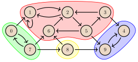
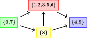

---
tags:
  - AI Translated
e_maxx_link: strongly-connected-components
---

# مؤلفه‌های قویاً همبند و گراف فشردگی

## تعاریف
فرض کنید $G=(V,E)$ یک گراف جهت‌دار با رئوس $V$ و یال‌های $E \subseteq V \times V$ باشد. تعداد رئوس را با $n=|V|$ و تعداد یال‌ها را با $m=|E|$ نمایش می‌دهیم. تعمیم تمام تعاریف این مقاله به چندگرافی‌ها (multigraphs) آسان است، اما ما روی آن تمرکز نخواهیم کرد.

یک زیرمجموعه از رئوس $C \subseteq V$ را یک **مؤلفه قویاً همبند** می‌نامیم اگر شرایط زیر برقرار باشد:

- برای هر $u,v\in C$ که $u \neq v$، یک مسیر از $u$ به $v$ و یک مسیر از $v$ به $u$ وجود داشته باشد، و
- $C$ بیشینه (maximal) باشد، به این معنا که هیچ رأسی را نمی‌توان به آن اضافه کرد بدون اینکه شرط بالا نقض شود.

مجموعه مؤلفه‌های قویاً همبند گراف $G$ را با $\text{SCC}(G)$ نمایش می‌دهیم. این مؤلفه‌های قویاً همبند با یکدیگر اشتراک ندارند و تمام رئوس گراف را پوشش می‌دهند. بنابراین، مجموعه $\text{SCC}(G)$ یک افراز از $V$ است.

گراف $G_\text{example}$ زیر را در نظر بگیرید که در آن مؤلفه‌های قویاً همبند مشخص شده‌اند:

<center></center>

در اینجا داریم: $\text{SCC}(G_\text{example})=\{\{0,7\},\{1,2,3,5,6\},\{4,9\},\{8\}\}.$ می‌توانیم تأیید کنیم که درون هر مؤلفه قویاً همبند، تمام رئوس از یکدیگر قابل دسترسی هستند.

**گراف فشردگی** $G^{\text{SCC}}=(V^{\text{SCC}}, E^{\text{SCC}})$ را به صورت زیر تعریف می‌کنیم:

- رئوس $G^{\text{SCC}}$ همان مؤلفه‌های قویاً همبند $G$ هستند؛ یعنی $V^{\text{SCC}} = \text{SCC}(G)$، و
- برای هر دو رأس $C_i$ و $C_j$ از گراف فشردگی، یک یال از $C_i$ به $C_j$ وجود دارد اگر و تنها اگر $C_i \neq C_j$ و رئوسی مانند $a\in C_i$ و $b\in C_j$ وجود داشته باشند که یک یال از $a$ به $b$ در گراف $G$ باشد.

گراف فشردگی $G_\text{example}$ به شکل زیر است:

<center></center>


مهم‌ترین ویژگی گراف فشردگی این است که **غیرمدور (acyclic)** است. در واقع، طبق تعریف، هیچ 'طوقه‌ای' (self-loop) در گراف فشردگی وجود ندارد، و اگر دوری وجود داشت که از دو یا چند رأس (مؤلفه‌های قویاً همبند) در گراف فشردگی عبور می‌کرد، آنگاه به دلیل خاصیت دسترسی‌پذیری، اجتماع این مؤلفه‌های قویاً همبند خود باید یک مؤلفه قویاً همبند واحد باشد: که این یک تناقض است.

الگوریتم توصیف‌شده در بخش بعدی تمام مؤلفه‌های قویاً همبند را در یک گراف داده‌شده پیدا می‌کند. پس از آن، می‌توان گراف فشردگی را ساخت.

## شرح الگوریتم
الگوریتم توصیف‌شده به طور مستقل توسط Kosaraju و Sharir در حدود سال 1980 پیشنهاد شد. این الگوریتم بر پایه دو سری [جستجوی عمق-اول](depth-first-search.md) است و زمان اجرای آن $O(n + m)$ می‌باشد.

در گام اول الگوریتم، یک سری جستجوی عمق-اول (`dfs`) را اجرا می‌کنیم و کل گراف را پیمایش می‌کنیم. به این معنی که تا زمانی که رئوس ملاقات‌نشده‌ای وجود دارد، یکی از آن‌ها را برداشته و یک جستجوی عمق-اول را از آن رأس آغاز می‌کنیم. برای هر رأس، *زمان خروج* $t_\text{out}[v]$ را ثبت می‌کنیم. این 'برچسب زمانی' است که اجرای `dfs` روی رأس $v$ به پایان می‌رسد، یعنی لحظه‌ای که تمام رئوس قابل دسترسی از $v$ ملاقات شده‌اند و الگوریتم به رأس $v$ بازگشته است. شمارنده برچسب زمانی نباید بین فراخوانی‌های متوالی `dfs` بازنشانی (reset) شود. زمان‌های خروج نقش کلیدی در الگوریتم دارند که با بحث در مورد قضیه زیر، این موضوع روشن‌تر خواهد شد.

ابتدا، زمان خروج $t_\text{out}[C]$ برای یک مؤلفه قویاً همبند $C$ را به عنوان بیشینه مقادیر $t_\text{out}[v]$ برای تمام $v \in C$ تعریف می‌کنیم. علاوه بر این، در اثبات قضیه، به *زمان ورود* $t_{\text{in}}[v]$ برای هر رأس $v \in G$ اشاره خواهیم کرد. عدد $t_{\text{in}}[v]$ 'برچسب زمانی' را نشان می‌دهد که تابع بازگشتی `dfs` در گام اول الگوریتم روی رأس $v$ فراخوانی می‌شود. برای یک مؤلفه قویاً همبند $C$، مقدار $t_{\text{in}}[C]$ را به عنوان کمینه مقادیر $t_{\text{in}}[v]$ برای تمام $v \in C$ تعریف می‌کنیم.

**قضیه**. فرض کنید $C$ و $C'$ دو مؤلفه قویاً همبند متفاوت باشند و یک یال از $C$ به $C'$ در گراف فشردگی وجود داشته باشد. آنگاه، $t_\text{out}[C] > t_\text{out}[C']$.

**اثبات.** دو حالت مختلف وجود دارد، بسته به اینکه کدام مؤلفه ابتدا توسط جستجوی عمق-اول ملاقات شود:

- حالت ۱: مؤلفه $C$ ابتدا ملاقات شده باشد (یعنی $t_{\text{in}}[C] < t_{\text{in}}[C']$). در این حالت، جستجوی عمق-اول رأس $v \in C$ را در لحظه‌ای ملاقات می‌کند که هیچ یک از رئوس دیگر مؤلفه‌های $C$ و $C'$ هنوز ملاقات نشده‌اند. از آنجایی که یک یال از $C$ به $C'$ در گراف فشردگی وجود دارد، نه تنها تمام رئوس دیگر در $C$ از $v$ در گراف $G$ قابل دسترسی هستند، بلکه تمام رئوس در $C'$ نیز قابل دسترسی هستند. این به این معنی است که اجرای `dfs` که از رأس $v$ شروع شده، تمام رئوس دیگر مؤلفه‌های $C$ و $C'$ را نیز در آینده ملاقات خواهد کرد، بنابراین این رئوس در درخت جستجوی عمق-اول، نوادگان $v$ خواهند بود. این امر نشان می‌دهد که برای هر رأس $u \in (C \cup C')\setminus \{v\}$، داریم $t_\text{out}[v] > t_\text{out}[u]$. بنابراین، $t_\text{out}[C] > t_\text{out}[C']$ که این حالت از اثبات را کامل می‌کند.

- حالت ۲: مؤلفه $C'$ ابتدا ملاقات شده باشد (یعنی $t_{\text{in}}[C] > t_{\text{in}}[C']$). در این حالت، جستجوی عمق-اول رأس $v \in C'$ را در لحظه‌ای ملاقات می‌کند که هیچ یک از رئوس دیگر مؤلفه‌های $C$ و $C'$ هنوز ملاقات نشده‌اند. از آنجایی که یک یال از $C$ به $C'$ در گراف فشردگی وجود دارد، طبق خاصیت غیرمدور بودن، $C$ از $C'$ قابل دسترسی نیست. بنابراین، اجرای `dfs` که از رأس $v$ در حال اجراست، به هیچ یک از رئوس $C$ نخواهد رسید، اما تمام رئوس $C'$ را ملاقات خواهد کرد. رئوس $C$ بعداً در طی این مرحله از الگوریتم توسط یک اجرای دیگر `dfs` ملاقات خواهند شد، بنابراین در واقع داریم $t_\text{out}[C] > t_\text{out}[C']$. این اثبات را کامل می‌کند.

قضیه اثبات‌شده برای یافتن مؤلفه‌های قویاً همبند بسیار مهم است. این به این معنی است که هر یال در گراف فشردگی از یک مؤلفه با مقدار $t_\text{out}$ بزرگتر به یک مؤلفه با مقدار کوچکتر می‌رود.

اگر تمام رئوس $v \in V$ را به ترتیب نزولی زمان خروجشان $t_\text{out}[v]$ مرتب کنیم، آنگاه اولین رأس $u$ به مؤلفه قویاً همبند "ریشه" تعلق خواهد داشت که در گراف فشردگی هیچ یال ورودی ندارد. اکنون می‌خواهیم نوعی جستجو را از این رأس $u$ اجرا کنیم تا تمام رئوس مؤلفه قویاً همبند خودش را ملاقات کند، اما رئوس دیگر را نه. با تکرار این کار، می‌توانیم به تدریج تمام مؤلفه‌های قویاً همبند را پیدا کنیم: تمام رئوس متعلق به اولین مؤلفه پیدا شده را حذف می‌کنیم، سپس رأس باقی‌مانده بعدی با بیشترین مقدار $t_\text{out}$ را پیدا کرده و جستجو را از آن اجرا می‌کنیم و به همین ترتیب ادامه می‌دهیم. در نهایت، تمام مؤلفه‌های قویاً همبند را پیدا خواهیم کرد. برای یافتن یک روش جستجو که مطابق میل ما رفتار کند، قضیه زیر را در نظر می‌گیریم:

**قضیه.** فرض کنید $G^T$ *گراف ترانهاده* $G$ باشد که با معکوس کردن جهت یال‌ها در $G$ به دست می‌آید. آنگاه $\text{SCC}(G)=\text{SCC}(G^T)$ است. علاوه بر این، گراف فشردگی $G^T$ ترانهاده گراف فشردگی $G$ است.

اثبات حذف شده است (اما سرراست است). به عنوان نتیجه‌ای از این قضیه، در گراف فشردگی $G^T$، هیچ یالی از مؤلفه "ریشه" به سایر مؤلفه‌ها وجود نخواهد داشت. بنابراین، برای پیمایش کل مؤلفه قویاً همبند "ریشه" که حاوی رأس $v$ است، می‌توانیم یک جستجوی عمق-اول را از رأس $v$ در گراف ترانهاده $G^T$ اجرا کنیم! این کار دقیقاً تمام رئوس این مؤلفه قویاً همبند را ملاقات خواهد کرد. همانطور که قبلاً ذکر شد، می‌توانیم سپس این رئوس را از گراف حذف کنیم. سپس، رأس بعدی با بیشترین مقدار $t_\text{out}[v]$ را پیدا کرده و جستجو را در گراف ترانهاده از آن رأس شروع می‌کنیم تا مؤلفه قویاً همبند بعدی را پیدا کنیم. با تکرار این فرآیند، تمام مؤلفه‌های قویاً همبند را پیدا می‌کنیم.

بنابراین، به طور خلاصه، الگوریتم زیر را برای یافتن مؤلفه‌های قویاً همبند مورد بحث قرار دادیم:

 - گام ۱. یک سری جستجوی عمق-اول را روی $G$ اجرا کنید که لیستی (مثلاً `order`) از رئوس را بر اساس زمان خروج $t_\text{out}$ صعودی مرتب می‌کند.

- گام ۲. گراف ترانهاده $G^T$ را بسازید و یک سری جستجوی عمق-اول را روی رئوس به ترتیب معکوس (یعنی به ترتیب نزولی زمان‌های خروج) اجرا کنید. هر جستجوی عمق-اول یک مؤلفه قویاً همبند را به دست خواهد داد.

- گام ۳ (اختیاری). گراف فشردگی را بسازید.

پیچیدگی زمانی الگوریتم $O(n + m)$ است، زیرا جستجوی عمق-اول دو بار انجام می‌شود. ساختن گراف فشردگی نیز $O(n+m)$ است.

در نهایت، شایسته است که در اینجا به [مرتب‌سازی توپولوژیک](topological-sort.md) اشاره کنیم. در گام ۱، رئوس را به ترتیب صعودی زمان خروج پیدا می‌کنیم. اگر $G$ غیرمدور باشد، این ترتیب معادل یک مرتب‌سازی توپولوژیک (معکوس) از $G$ است. در گام ۲، الگوریتم مؤلفه‌های قویاً همبند را به ترتیب نزولی زمان خروجشان پیدا می‌کند. بنابراین، مؤلفه‌ها - یعنی رئوس گراف فشردگی - را به ترتیبی پیدا می‌کند که با یک مرتب‌سازی توپولوژیک از گراف فشردگی مطابقت دارد.

## پیاده‌سازی
```{.cpp file=strongly_connected_components}
vector<bool> visited; // برای پیگیری اینکه کدام رئوس قبلاً ملاقات شده‌اند

// جستجوی عمق-اول را از رأس v شروع می‌کند.
// هر رأس ملاقات‌شده هنگام خروج dfs از آن، به بردار خروجی اضافه می‌شود.
void dfs(int v, vector<vector<int>> const& adj, vector<int> &output) {
    visited[v] = true;
    for (auto u : adj[v])
        if (!visited[u])
            dfs(u, adj, output);
    output.push_back(v);
}

// ورودی: adj -- لیست مجاورت G
// خروجی: components -- مؤلفه‌های قویاً همبند در G
// خروجی: adj_cond -- لیست مجاورت G^SCC (بر اساس رئوس ریشه)
void strongly_connected_components(vector<vector<int>> const& adj,
                                  vector<vector<int>> &components,
                                  vector<vector<int>> &adj_cond) {
    int n = adj.size();
    components.clear(), adj_cond.clear();

    vector<int> order; // لیستی مرتب‌شده از رئوس G بر اساس زمان خروج خواهد بود

    visited.assign(n, false);

    // سری اول جستجوهای عمق-اول
    for (int i = 0; i < n; i++)
        if (!visited[i])
            dfs(i, adj, order);

    // ایجاد لیست مجاورت G^T
    vector<vector<int>> adj_rev(n);
    for (int v = 0; v < n; v++)
        for (int u : adj[v])
            adj_rev[u].push_back(v);

    visited.assign(n, false);
    reverse(order.begin(), order.end());

    vector<int> roots(n, 0); // رأس ریشه مؤلفه قویاً همبند یک رأس را می‌دهد

    // سری دوم جستجوهای عمق-اول
    for (auto v : order)
        if (!visited[v]) {
            std::vector<int> component;
            dfs(v, adj_rev, component);
            components.push_back(component);
            int root = *min_element(begin(component), end(component));
            for (auto u : component)
                roots[u] = root;
        }

    // اضافه کردن یال‌ها به گراف فشردگی
    adj_cond.assign(n, {});
    for (int v = 0; v < n; v++)
        for (auto u : adj[v])
            if (roots[v] != roots[u])
                adj_cond[roots[v]].push_back(roots[u]);
}
```

تابع `dfs` جستجوی عمق-اول را پیاده‌سازی می‌کند. این تابع به عنوان ورودی یک لیست مجاورت و یک رأس شروع را می‌گیرد. همچنین یک ارجاع به بردار `output` می‌گیرد: هر رأس ملاقات‌شده هنگام خروج `dfs` از آن، به `output` اضافه می‌شود.

توجه داشته باشید که ما از تابع `dfs` هم در گام اول و هم در گام دوم الگوریتم استفاده می‌کنیم. در گام اول، لیست مجاورت $G$ را به تابع پاس می‌دهیم و در طی فراخوانی‌های متوالی `dfs`، همان 'بردار خروجی' `order` را پاس می‌دهیم تا در نهایت لیستی از رئوس را به ترتیب صعودی زمان خروج به دست آوریم. در گام دوم، لیست مجاورت $G^T$ را پاس می‌دهیم و در هر فراخوانی، یک 'بردار خروجی' خالی `component` را پاس می‌دهیم که هر بار یک مؤلفه قویاً همبند را به ما می‌دهد.

هنگام ساختن لیست مجاورت گراف فشردگی، *ریشه* هر مؤلفه را به عنوان اولین رأس در لیست رئوس آن انتخاب می‌کنیم (این یک انتخاب اختیاری است). این رأس ریشه، کل مؤلفه قویاً همبند خود را نمایندگی می‌کند. برای هر رأس `v`، مقدار `roots[v]` رأس ریشه مؤلفه‌ای را نشان می‌دهد که `v` به آن تعلق دارد.

گراف فشردگی ما اکنون با رئوس `components` (هر مؤلفه قویاً همبند معادل یک رأس در گراف فشردگی است) و لیست مجاورت `adj_cond` که فقط از رئوس ریشه مؤلفه‌های قویاً همبند استفاده می‌کند، داده می‌شود. توجه کنید که ما به ازای هر یال از $a\in C$ به $b\in C'$ در $G$ (اگر $C\neq C'$)، یک یال از $C$ به $C'$ در $G^\text{SCC}$ تولید می‌کنیم. این بدان معناست که در پیاده‌سازی ما، ممکن است چندین یال بین دو مؤلفه در گراف فشردگی وجود داشته باشد.

## منابع

* Thomas Cormen, Charles Leiserson, Ronald Rivest, Clifford Stein. Introduction to Algorithms [2005].
* M. Sharir. A strong-connectivity algorithm and its applications in data-flow analysis [1979].

## مسائل تمرینی

* [SPOJ - Good Travels](http://www.spoj.com/problems/GOODA/)
* [SPOJ - Lego](http://www.spoj.com/problems/LEGO/)
* [Codechef - Chef and Round Run](https://www.codechef.com/AUG16/problems/CHEFRRUN)
* [UVA - 11838 - Come and Go](https://uva.onlinejudge.org/index.php?option=com_onlinejudge&Itemid=8&page=show_problem&problem=2938)
* [UVA 247 - Calling Circles](https://uva.onlinejudge.org/index.php?option=onlinejudge&page=show_problem&problem=183)
* [UVA 13057 - Prove Them All](https://uva.onlinejudge.org/index.php?option=com_onlinejudge&Itemid=8&page=show_problem&problem=4955)
* [UVA 12645 - Water Supply](https://uva.onlinejudge.org/index.php?option=com_onlinejudge&Itemid=8&page=show_problem&problem=4393)
* [UVA 11770 - Lighting Away](https://uva.onlinejudge.org/index.php?option=com_onlinejudge&Itemid=8&page=show_problem&problem=2870)
* [UVA 12926 - Trouble in Terrorist Town](https://uva.onlinejudge.org/index.php?option=com_onlinejudge&Itemid=8&category=862&page=show_problem&problem=4805)
* [UVA 11324 - The Largest Clique](https://uva.onlinejudge.org/index.php?option=com_onlinejudge&Itemid=8&page=show_problem&problem=2299)
* [UVA 11709 - Trust groups](https://uva.onlinejudge.org/index.php?option=com_onlinejudge&Itemid=8&page=show_problem&problem=2756)
* [UVA 12745 - Wishmaster](https://uva.onlinejudge.org/index.php?option=com_onlinejudge&Itemid=8&page=show_problem&problem=4598)
* [SPOJ - True Friends](http://www.spoj.com/problems/TFRIENDS/)
* [SPOJ - Capital City](http://www.spoj.com/problems/CAPCITY/)
* [Codeforces - Scheme](http://codeforces.com/contest/22/problem/E)
* [SPOJ - Ada and Panels](http://www.spoj.com/problems/ADAPANEL/)
* [CSES - Flight Routes Check](https://cses.fi/problemset/task/1682)
* [CSES - Planets and Kingdoms](https://cses.fi/problemset/task/1683)
* [CSES - Coin Collector](https://cses.fi/problemset/task/1686)
* [Codeforces - Checkposts](https://codeforces.com/problemset/problem/427/C)