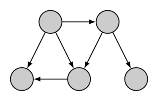
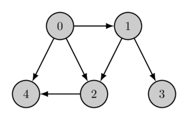

---
tags:
  - AI Translated
e_maxx_link: topological-sort
---

# مرتب‌سازی توپولوژیک

یک گراف جهت‌دار با $n$ رأس و $m$ یال به شما داده شده است. شما باید **ترتیبی از رأس‌ها** را پیدا کنید، به طوری که هر یال از رأسی با اندیس کوچکتر به رأسی با اندیس بزرگتر برود.

به عبارت دیگر، شما می‌خواهید یک جایگشت از رأس‌ها (**ترتیب توپولوژیک**) را پیدا کنید که با ترتیب تعریف شده توسط تمام یال‌های گراف مطابقت داشته باشد.

در اینجا یک گراف داده شده به همراه ترتیب توپولوژیک آن آمده است:

<div style="text-align: center;">
  
  
</div>

ترتیب توپولوژیک می‌تواند **یکتا نباشد** (برای مثال، اگر سه رأس $a$، $b$ و $c$ وجود داشته باشند که مسیرهایی از $a$ به $b$ و از $a$ به $c$ موجود باشد اما مسیری از $b$ به $c$ یا از $c$ به $b$ وجود نداشته باشد). گراف مثال نیز چندین ترتیب توپولوژیک دارد، ترتیب توپولوژیک دوم به صورت زیر است:
<div style="text-align: center;">
  
</div>

یک ترتیب توپولوژیک ممکن است اصلاً **وجود نداشته باشد**. این ترتیب تنها در صورتی وجود دارد که گراف جهت‌دار هیچ دوری نداشته باشد. در غیر این صورت، یک تناقض وجود دارد: اگر دوری شامل رأس‌های $a$ و $b$ باشد، آنگاه $a$ باید اندیسی کوچکتر از $b$ داشته باشد (چون می‌توانید از $a$ به $b$ برسید) و همچنین اندیسی بزرگتر (چون می‌توانید از $b$ به $a$ برسید). الگوریتم توصیف شده در این مقاله همچنین با ساختن نشان می‌دهد که هر گراف جهت‌دار بدون دور، حداقل یک ترتیب توپولوژیک دارد.

یک مسئله رایج که در آن مرتب‌سازی توپولوژیک به کار می‌آید به شرح زیر است. $n$ متغیر با مقادیر نامعلوم وجود دارد. برای برخی متغیرها، می‌دانیم که یکی از آنها کوچکتر از دیگری است. شما باید بررسی کنید که آیا این محدودیت‌ها متناقض هستند یا خیر، و اگر نیستند، متغیرها را به ترتیب صعودی خروجی دهید (اگر چندین جواب ممکن است، هر کدام را می‌توانید خروجی دهید). به راحتی می‌توان متوجه شد که این دقیقاً مسئله یافتن ترتیب توپولوژیک یک گراف با $n$ رأس است.

## الگوریتم

برای حل این مسئله، از [جستجوی اول عمق](depth-first-search.md) استفاده خواهیم کرد.

فرض کنیم گراف بدون دور است. جستجوی اول عمق چه کاری انجام می‌دهد؟

هنگام شروع از یک رأس $v$، DFS سعی می‌کند تمام یال‌های خروجی از $v$ را پیمایش کند. پیمایش در یال‌هایی که رأس‌های انتهایی آنها قبلاً بازدید شده‌اند متوقف می‌شود و در امتداد بقیه یال‌ها ادامه یافته و به صورت بازگشتی در انتهای آنها ادامه می‌یابد.

بنابراین، تا زمانی که فراخوانی تابع $\text{dfs}(v)$ به پایان می‌رسد، تمام رأس‌هایی که از $v$ قابل دسترسی هستند، به صورت مستقیم (از طریق یک یال) یا غیرمستقیم توسط جستجو بازدید شده‌اند.

بیایید رأس $v$ را زمانی که کار $\text{dfs}(v)$ تمام می‌شود، به یک لیست اضافه کنیم. از آنجایی که تمام رأس‌های قابل دسترس قبلاً بازدید شده‌اند، آنها هنگام اضافه کردن $v$ از قبل در لیست خواهند بود. این کار را برای هر رأس در گراف، با یک یا چند بار اجرای جستجوی اول عمق انجام می‌دهیم. برای هر یال جهت‌دار $v \rightarrow u$ در گراف، $u$ زودتر از $v$ در این لیست ظاهر می‌شود، زیرا $u$ از $v$ قابل دسترسی است. بنابراین اگر رأس‌های این لیست را با $n-1, n-2, \dots, 1, 0$ برچسب‌گذاری کنیم، یک ترتیب توپولوژیک از گراف را پیدا کرده‌ایم. به عبارت دیگر، لیست، ترتیب توپولوژیک معکوس را نشان می‌دهد.

این توضیحات را می‌توان بر اساس زمان خروج الگوریتم DFS نیز ارائه داد. زمان خروج برای رأس $v$ زمانی است که فراخوانی تابع $\text{dfs}(v)$ به پایان رسیده است (زمان‌ها را می‌توان از $0$ تا $n-1$ شماره‌گذاری کرد). به راحتی می‌توان فهمید که زمان خروج هر رأس $v$ همیشه بیشتر از زمان خروج هر رأسی است که از آن قابل دسترسی است (زیرا آنها یا قبل از فراخوانی $\text{dfs}(v)$ یا در طول آن بازدید شده‌اند). بنابراین، ترتیب توپولوژیک مورد نظر، رأس‌ها به ترتیب نزولی زمان خروجشان است.

## پیاده‌سازی

در اینجا یک پیاده‌سازی ارائه شده است که فرض می‌کند گراف بدون دور است، یعنی ترتیب توپولوژیک مورد نظر وجود دارد. در صورت لزوم، می‌توانید به راحتی بررسی کنید که آیا گراف بدون دور است یا خیر، همانطور که در مقاله [جستجوی اول عمق](depth-first-search.md) توضیح داده شده است.

```cpp
int n; // تعداد رأس‌ها
vector<vector<int>> adj; // لیست مجاورت گراف
vector<bool> visited;
vector<int> ans;

void dfs(int v) {
    visited[v] = true;
    for (int u : adj[v]) {
        if (!visited[u]) {
            dfs(u);
        }
    }
    ans.push_back(v);
}

void topological_sort() {
    visited.assign(n, false);
    ans.clear();
    for (int i = 0; i < n; ++i) {
        if (!visited[i]) {
            dfs(i);
        }
    }
    reverse(ans.begin(), ans.end());
}
```

تابع اصلی این راه‌حل `topological_sort` است که متغیرهای DFS را مقداردهی اولیه می‌کند، DFS را اجرا می‌کند و پاسخ را در وکتور `ans` دریافت می‌کند. شایان ذکر است که وقتی گراف بدون دور نباشد، نتیجه `topological_sort` هنوز تا حدودی معنادار خواهد بود به این معنا که اگر رأس $u$ از رأس $v$ قابل دسترسی باشد، اما برعکس آن صادق نباشد، رأس $v$ همیشه در آرایه حاصل، اول خواهد آمد. این ویژگی پیاده‌سازی ارائه شده در [الگوریتم Kosaraju](./strongly-connected-components.md) برای استخراج مؤلفه‌های قویاً همبند و مرتب‌سازی توپولوژیک آنها در یک گراف جهت‌دار با دور استفاده می‌شود.

## مسائل تمرینی

- [SPOJ TOPOSORT - Topological Sorting [سطح: آسان]](http://www.spoj.com/problems/TOPOSORT/)
- [UVA 10305 - Ordering Tasks [سطح: آسان]](https://onlinejudge.org/index.php?option=com_onlinejudge&Itemid=8&page=show_problem&problem=1246)
- [UVA 124 - Following Orders [سطح: آسان]](https://onlinejudge.org/index.php?option=onlinejudge&page=show_problem&problem=60)
- [UVA 200 - Rare Order [سطح: آسان]](https://onlinejudge.org/index.php?option=onlinejudge&page=show_problem&problem=136)
- [Codeforces 510C - Fox and Names [سطح: آسان]](http://codeforces.com/problemset/problem/510/C)
- [SPOJ RPLA - Answer the boss!](https://www.spoj.com/problems/RPLA/)
- [CSES - Course Schedule](https://cses.fi/problemset/task/1679)
- [CSES - Longest Flight Route](https://cses.fi/problemset/task/1680)
- [CSES - Game Routes](https://cses.fi/problemset/task/1681)