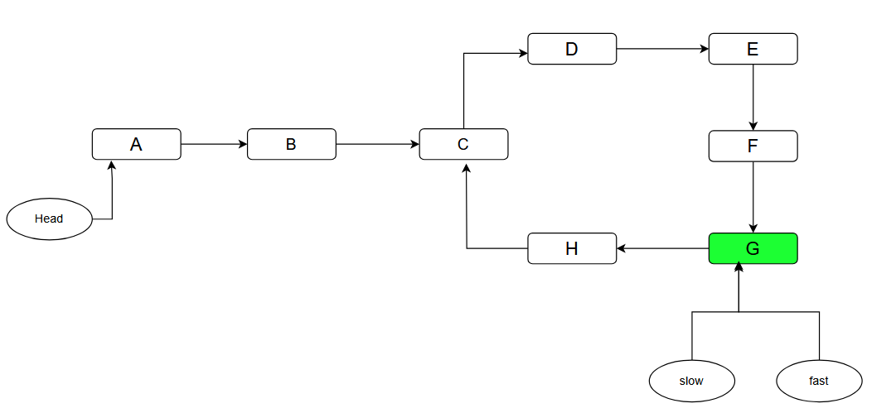
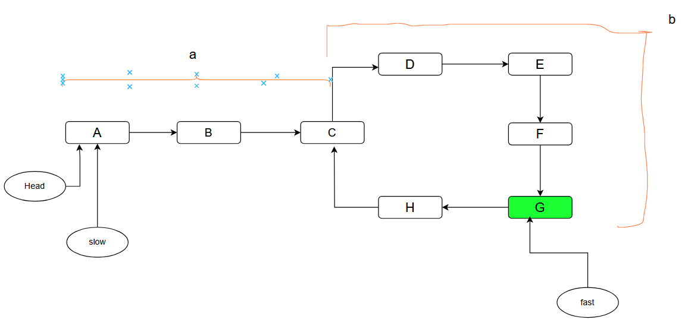

---
tags:
  - AI Translated
e_maxx_link: tortoise_and_hare
---

# الگوریتم Floyd برای پیدا کردن چرخه در لیست پیوندی

یک لیست پیوندی (linked list) را در نظر بگیرید که نقطه شروع آن با **head** مشخص شده است و ممکن است در آن چرخه وجود داشته باشد یا نداشته باشد. برای مثال:

<div style="text-align: center;">
  
</div>

در اینجا باید نقطه **C**، یعنی نقطه شروع چرخه را پیدا کنیم.

## الگوریتم پیشنهادی
این الگوریتم، **الگوریتم چرخه Floyd یا الگوریتم لاک‌پشت و خرگوش (Tortoise And Hare)** نامیده می‌شود.
برای پیدا کردن نقطه شروع چرخه، ابتدا باید بفهمیم که آیا اصلاً چرخه‌ای وجود دارد یا نه.
بنابراین، این کار شامل دو مرحله است:
۱. تشخیص وجود چرخه.
۲. پیدا کردن نقطه شروع چرخه.

### مرحله ۱: تشخیص وجود چرخه
۱. دو اشاره‌گر (pointer) به نام‌های $slow$ و $fast$ در نظر بگیرید.
۲. هر دوی آن‌ها در ابتدا به head لیست پیوندی اشاره می‌کنند.
۳. اشاره‌گر $slow$ در هر مرحله یک قدم حرکت می‌کند.
۴. اشاره‌گر $fast$ در هر مرحله دو قدم حرکت می‌کند (سرعت آن دو برابر اشاره‌گر $slow$ است).
۵. بررسی کنید که آیا در هیچ نقطه‌ای قبل از اینکه یکی از آن‌ها (یا هر دو) به null برسند، به یک گره (node) یکسان اشاره می‌کنند یا خیر.
۶. اگر در هر نقطه‌ای از مسیرشان به یک گره یکسان اشاره کنند، این نشان می‌دهد که در لیست پیوندی واقعاً یک چرخه وجود دارد.
۷. اگر به null برسیم، این نشان می‌دهد که لیست پیوندی چرخه‌ای ندارد.

<div style="text-align: center;">
  
</div>

اکنون که فهمیدیم در لیست پیوندی یک چرخه وجود دارد، برای مرحله بعد باید نقطه شروع چرخه، یعنی **C** را پیدا کنیم.
### مرحله ۲: پیدا کردن نقطه شروع چرخه
۱. اشاره‌گر $slow$ را به **head** لیست پیوندی بازنشانی (reset) کنید.
۲. هر دو اشاره‌گر را در هر مرحله یک قدم حرکت دهید.
۳. نقطه‌ای که در آن به هم می‌رسند، نقطه شروع چرخه خواهد بود.

```java
// تشخیص وجود چرخه
public boolean hasCycle(ListNode head) {
    ListNode slow = head;
    ListNode fast = head;

    while(fast != null && fast.next != null){
        slow = slow.next;
        fast = fast.next.next;
        if(slow==fast){
            return true;
        }
    }

    return false;
}
```

```java
// با فرض اینکه چرخه‌ای وجود دارد و slow و fast به نقطه تلاقی خود اشاره می‌کنند
slow = head;
while(slow!=fast){
	slow = slow.next;
	fast = fast.next;
}

return slow; // نقطه شروع چرخه
```

## چرا این الگوریتم کار می‌کند

### مرحله ۱: تشخیص وجود چرخه
از آنجا که اشاره‌گر $fast$ با سرعتی دو برابر $slow$ حرکت می‌کند، می‌توانیم بگوییم در هر لحظه از زمان، $fast$ دو برابر مسافتی را که $slow$ طی کرده است، پیموده است.
همچنین می‌توانیم نتیجه بگیریم که اختلاف بین مسافت طی شده توسط هر دو اشاره‌گر به اندازه $1$ افزایش می‌یابد.
```
slow: 0 --> 1 --> 2 --> 3 --> 4 (مسافت طی شده)
fast: 0 --> 2 --> 4 --> 6 --> 8 (مسافت طی شده)
diff: 0 --> 1 --> 2 --> 3 --> 4 (تفاوت مسافت طی شده توسط دو اشاره‌گر)
```
فرض کنید $L$ طول چرخه باشد و $a$ تعداد قدم‌های لازم برای رسیدن اشاره‌گر slow به ورودی چرخه را نشان دهد. یک عدد صحیح مثبت $k$ ($k > 0$) وجود دارد به طوری که $k \cdot L \geq a$.
هنگامی که اشاره‌گر slow به اندازه $k \cdot L$ قدم حرکت کرده و اشاره‌گر fast به اندازه $2 \cdot k \cdot L$ قدم را پیموده است، هر دو اشاره‌گر خود را درون چرخه می‌یابند. در این نقطه، فاصله‌ای به اندازه $k \cdot L$ بین آن‌ها وجود دارد. با توجه به اینکه طول چرخه $L$ باقی می‌ماند، این بدان معناست که آن‌ها در یک نقطه یکسان در چرخه به هم می‌رسند که منجر به تلاقی آن‌ها می‌شود.

### مرحله ۲: پیدا کردن نقطه شروع چرخه

بیایید سعی کنیم مسافت طی شده توسط هر دو اشاره‌گر را تا نقطه‌ای که در چرخه به هم رسیده‌اند، محاسبه کنیم.

<div style="text-align: center;">
  
</div>

$slowDist = a + xL + b$            , $x\ge0$

$fastDist = a + yL + b$            , $y\ge0$

-   $slowDist$ کل مسافت طی شده توسط اشاره‌گر slow است.
-   $fastDist$ کل مسافت طی شده توسط اشاره‌گر fast است.
-   $a$ تعداد قدم‌هایی است که هر دو اشاره‌گر برای ورود به چرخه نیاز دارند.
-   $b$ فاصله بین **C** و **G** است، یعنی فاصله بین نقطه شروع چرخه و نقطه تلاقی دو اشاره‌گر.
-   $x$ تعداد دفعاتی است که اشاره‌گر slow داخل چرخه چرخیده است، با شروع و پایان در **C**.
-   $y$ تعداد دفعاتی است که اشاره‌گر fast داخل چرخه چرخیده است، با شروع و پایان در **C**.

$fastDist = 2 \cdot (slowDist)$

$a + yL + b = 2(a + xL + b)$

با حل این فرمول به نتیجه زیر می‌رسیم:

$a=(y-2x)L-b$

که در آن $y-2x$ یک عدد صحیح است.

این اساساً به این معنی است که طی کردن $a$ قدم، معادل انجام چند دور کامل در چرخه و سپس $b$ قدم به عقب رفتن است.
از آنجا که اشاره‌گر fast از قبل $b$ قدم از ورودی چرخه جلوتر است، اگر اشاره‌گر fast $a$ قدم دیگر حرکت کند، در ورودی چرخه قرار خواهد گرفت.
و از آنجا که ما اجازه می‌دهیم اشاره‌گر slow از ابتدای لیست پیوندی شروع کند، پس از $a$ قدم آن نیز به ورودی چرخه خواهد رسید. بنابراین، اگر هر دو $a$ قدم حرکت کنند، هر دو در ورودی چرخه به هم خواهند رسید.

# مسائل:
- [Linked List Cycle (آسان)](https://leetcode.com/problems/linked-list-cycle/)
- [Happy Number (آسان)](https://leetcode.com/problems/happy-number/)
- [Find the Duplicate Number (متوسط)](https://leetcode.com/problems/find-the-duplicate-number/)